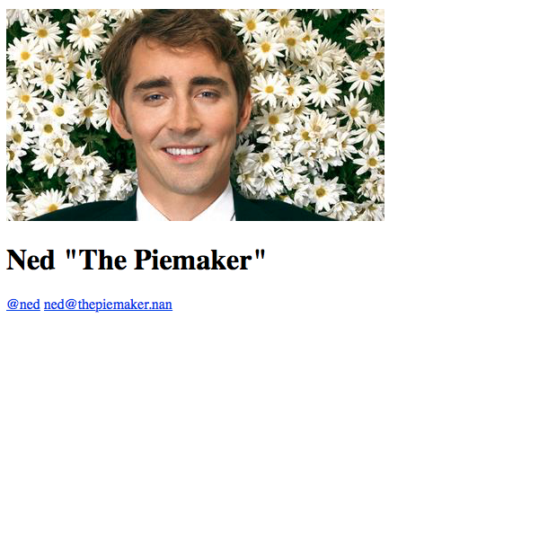

theme: Titillium, 1
autoscale: true

# IndieWeb
## The **person-focused** alternative to the _corporate web_

^ So what is the "IndieWeb"?

^ It's a set of principles and building blocks for you to independently maintain your social data on your own web domains rather than on large, centralized social networking services.

---

# Dash, Anil (@anildash)

> Google’s decision to kill Google Reader was a turning point in enabling media
> to be manipulated by misinformation campaigns. The difference between
> individuals choosing the feeds they read & companies doing it for you affects
> all other forms of media.
-- [2 April 2018](https://twitter.com/anildash/status/980930699271245825)

---

# Principles

1.  ✊ Own your data
2.  🔍 Use visible data
3.  💪 Make tools for yourself
4.  😋 Use what you make!
5.  📓 Document
6.  💞 Open source
7.  📐 UX and design is more important
8.  🌐 Build platform agnostic platforms.
9.  🗿 Longevity. Build for the long web.
10. ✨ Plurality.
11. 🎉 Have fun.

<https://indieweb.org/principles>

---

# Building Blocks

*   Microformats
*   Posts
*   Citability
*   Syndication
*   Mentions
*   Login
*   Web Actions
*   Link Preview
*   Reply Context

---

# Step
# [fit] Zero

---

# Get a **personal domain**

## You need your own personal domain to use as your primary online identity.

^ Get your own personal domain name. This is the first and most important set in join the IndieWeb community.

^ It should be a domain name that you personally own, control, and use to represent yourself on the internet.

---

# Step
# [fit] One

---

# Build your site

---



---

```html
<!DOCTYPE html>
<html>
  <head>
    <title>Ned, The Piemaker</title>
  </head>
  <body class="h-card">

    

    <h1 class="p-name">
      Ned "The Piemaker"
    </h1>

    <p>
      <a class="u-email" rel="me"
         href="mailto:ned@thepiemaker.ca">
        ned@thepiemaker.ca
      </a>

      <a class="u-url" rel="me"
         href="https://twitter.com/ned">
        @ned
      </a>
    </p>
  </body>
</html>
```

---

# Step
# [fit] Two

---

# Deploy your website

---

# [fit] IndieMark
# [fit] Level One

# `#ownyourdata` `#ownyouridentity`
